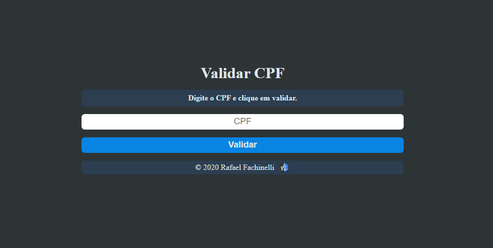

  

 
  
  
  
  

 <a href="#movie_camera-demonstração">Demonstração</a> •
 <a href="#computer-sobre">Sobre</a> •
 <a href="#memo-roteiro">Roteiro</a> •
 <a href="#hammer-tecnologias">Tecnologias</a> •
 <a href="#boy-autor">Autor</a> •
 <a href="#page_facing_up-licença">Licença</a>

---
## :movie_camera: **Demonstração**

  <kbd></kbd>

  
---
## :computer: Sobre

Neste projeto o CPF é verificado através da fórmula que gera os digitos e compara com os recebidos. Utilizando a captura do valor do input e clique do botão, toda a lógica é executada retornando o resultado da verificação.

Toda a programação foi desenvolvida para treinar os conceitos do livro Clean Code, criando funções pequenas e com nomes significativos para evitar o uso de comentários e aumentar significativamente a interpretação da lógica de funcionamento do código.

---
## :memo: **Roteiro**

Clique para Visualizar

|      Estado      |     Tarefa    |
|      :---:       |      :---     |
|:heavy_check_mark:|Organização de arquivos|
|:heavy_check_mark:|Estrutura HTML|
|:heavy_check_mark:|Programação JavaScript para teste|
|:heavy_check_mark:|Estilização CSS básica|
|:heavy_check_mark:|Funções JavaScript refinada|
|:heavy_check_mark:|Estilização refinada|

---
## :hammer: **Tecnologias**

As seguintes ferramentas foram utilizadas na construção do projeto:

|:computer: Desktop|
|:---:|
|[HTML5](https://developer.mozilla.org/pt-BR/docs/Web/HTML/HTML5)	|
|[CSS3](https://developer.mozilla.org/pt-BR/docs/Archive/CSS3)		|
|[JavaScript](https://www.ecma-international.org/publications/standards/Ecma-262.htm)|

---
## :boy: **Autor**

<a href="https://github.com/rafaelfachinelli">
 
  
 <b>Rafael Fachinelli</b></a>

Feito com ❤️ por Rafael Fachinelli 👋🏽 Entre em contato!

---
## :page_facing_up: **Licença**

Copyright © 2020 [Rafael Fachinelli](https://github.com/rafaelfachinelli). 
Este projeto é licenciado pelo [MIT](./LICENSE).

